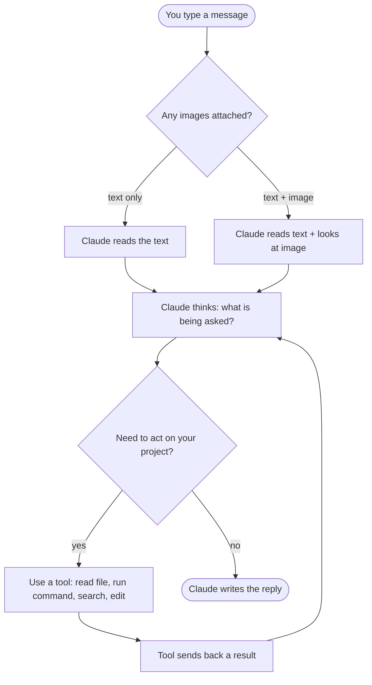
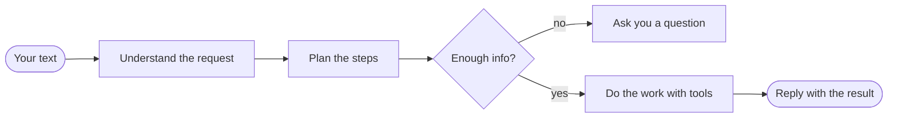
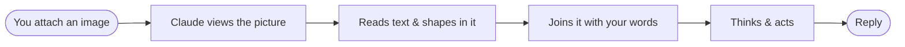

# How Claude Code builds a reply — chat & image flow

A simple map of what happens after you send a chat message — with or without
images — so you don't have to read long explanations to understand the flow.

> **Tip while reading Claude:** you don't need to read every line. Watch for two
> things — a **question** (Claude needs your answer to continue) and the **final
> reply** (the result). Everything in between is Claude looking, thinking, and
> using tools.

---

## 1. The whole picture

Everything you send arrives as one message. Claude reads it, thinks, sometimes
uses tools (reading files, running commands, searching), then writes back. It
can loop through tools many times before the final reply.

---

## 2. The chat path

When you send only words, this is the road the message travels.

---

## 3. The image path

When you attach a screenshot, photo, or diagram, Claude adds a "look at it" step
before thinking. Images become part of the same message as your text.

---

## 4. The same flow, in plain words

1. **You send** — your text, and any images, go to Claude together as one message.
2. **Claude looks** — it reads your words. If there is an image, it looks at the
   image too and reads what is inside it.
3. **Claude thinks** — it works out what you actually want and makes a small plan.
4. **Claude acts** — if needed, it uses tools (open a file, run a command, search
   the code) and can repeat this many times.
5. **Claude replies** — when the work is done or a question is needed, it writes
   back to you.
